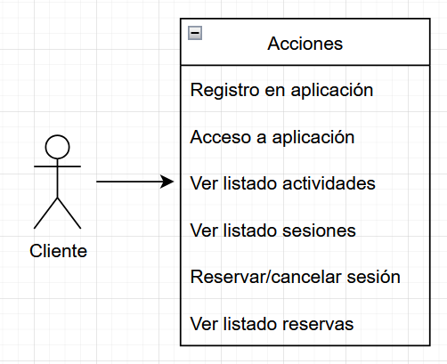
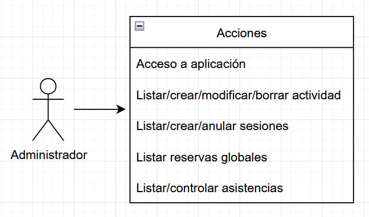

## Descripción del proyecto
Aplicación multiplataforma de gestión de actividades de un gimnasio.
- Backend - Python + Flask
- Desktop - Vue + Electron
- Mobile - React Native

## Problemas encontrados en el desarrollo
- Diseño conceptual preliminar del proyecto.
- Configuraciones iniciales enrevesadas en algunos casos.
- Tiempo requerido en conocer las nuevas tecnologías.
- Sintaxis poco amigable en consultas complejas de MongoDB.
- Dificultades de comunicación entre front y back.

## Diagramas de casos de uso

